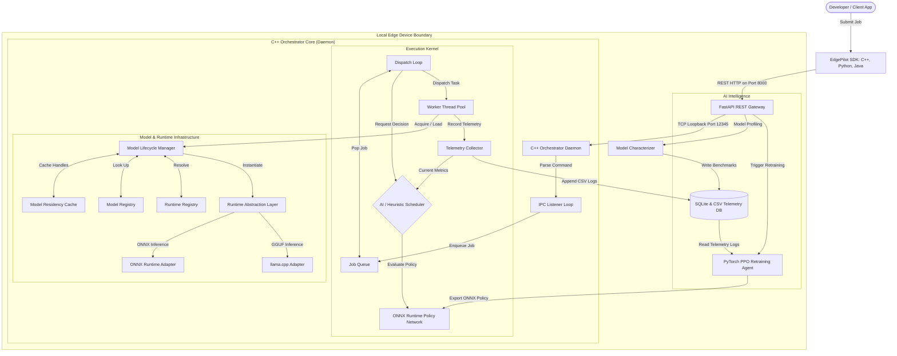

# ▲ EdgePilot System Architecture

EdgePilot is an OS-inspired, adaptive on-device AI workload orchestrator. This document details the system components, data pipelines, local execution boundaries, and key engineering decisions.

---

## 1. System Block Diagram

The system operates entirely within the boundaries of the local edge device, leveraging a decoupled architecture between a high-performance **C++ Core Daemon** (handling safe execution, residency caching, and low-latency scheduling) and a high-level **Python FastAPI Gateway** (serving REST endpoints, native UI diagnostics, and background retraining).



---

## 2. Model Pipeline & Data Flow

Inference requests move through five distinct phases to guarantee thread safety, optimal runtime selection, and system stability.

```
[Client Request] ──(Phase 1)──> [FastAPI REST Gateway] ──(IPC Loopback)──> [C++ Daemon Queue]
                                                                                │
[Telemetry Logs] <──(Phase 5)── [Telemetry DB & Retraining] <──(Phase 4)── [RAL Execution]
```

### Phase 1: SDK Submission & REST Routing
1. A developer submits a job specifying a `model_id`, a text or tensor input `prompt`, and an execution `priority` via one of the Client SDKs.
2. The FastAPI REST gateway intercepts the HTTP request, formats it into a space-separated IPC command protocol:
   `SUBMIT <job_id> <model_id> <priority> <prompt>`
3. The gateway initiates a TCP loopback socket connection (`127.0.0.1:12345`) and sends the raw command string to the daemon.

### Phase 2: Job Enqueueing & Scheduling Decision
1. The daemon's `IPC Listener Loop` reads the command, instantiates a thread-safe `Job` struct, and pushes it to the FIFO `JobQueue`.
2. The background `Dispatch Loop` pops the next job from the queue and queries the `AIScheduler`.
3. The scheduler gathers real-time telemetry metrics (CPU/GPU utilization, free RAM, battery, thermal state) from the `TelemetryCollector`.
4. If ONNX models are available, the scheduler feeds the normalized state vector to the ONNX Runtime-powered Policy network (`rl_scheduler_policy.onnx`), yielding a target runtime, quantization variant, preloads, evictions, or execution delays.

### Phase 3: Residency Resolution & Model Loading
1. The orchestrator worker thread pool picks up the scheduled job task.
2. It processes the scheduler's model evictions by calling `ModelLifecycleManager::Unload()`.
3. It resolves the model metadata from the `ModelRegistry` and active runtimes from the `RuntimeRegistry`.
4. It calls `ModelLifecycleManager::Load()`. If the model is already resident in the in-memory cache, it immediately returns the cached `IActiveModel` handle. Otherwise, the matching Adapter initializes the model and streams its weights into memory.

### Phase 4: Thread-Safe Inference Execution
1. The worker thread wraps the model inference execution in reference-counting markers:
   ```cpp
   lifecycle_manager.AcquireInference(model_id);
   auto result = active_model->RunInference(request);
   lifecycle_manager.ReleaseInference(model_id);
   ```
2. The active adapter (e.g. `llama_cpp` or `onnx`) executes the inference, capturing raw system performance parameters (actual execution time `latency_us`, output tokens, and success flags).

### Phase 5: Telemetry Logging & Retraining Trigger
1. Upon job completion, the worker thread compiles execution statistics, estimates peak memory (bytes) and energy usage (joules), and writes a `TelemetryRecord` using the `TelemetryCollector` to the local CSV database (`edgepilot_telemetry.csv`).
2. The gateway returns the job results to the client.
3. If the job was successful, FastAPI schedules an asynchronous background task to call `relearn_online()`, reading the CSV logs, running PyTorch reinforcement learning gradient updates, and re-exporting the updated ONNX policy.

---

## 3. Local/Cloud Components Distribution

EdgePilot operates under a strict **Zero-Cloud policy**:

| Component | Execution Context | Network Dependency | Storage Type |
| :--- | :--- | :--- | :--- |
| **FastAPI REST Gateway** | Local Python Process (Port 8000) | Loopback Only | N/A |
| **C++ Core Daemon** | Local Native Executable (Port 12345) | Loopback Only | N/A |
| **ONNX Runtime (RAL)** | Dynamic Library linked to Daemon | None (Offline) | Local disk / RAM |
| **llama.cpp (RAL)** | Dynamic Library linked to Daemon | None (Offline) | Local disk / RAM |
| **Telemetry DB** | Local SQLite (`edgepilot_telemetry.db`) | None (Offline) | Local Disk (SQLite/CSV) |
| **Retraining Module** | Local PyTorch Script (`train_rl_scheduler.py`) | None (Offline) | Local Disk (ONNX export) |
| **SDK Clients** | Host C++/Python/Java applications | Local loopback interface | N/A |

---

## 4. Key Design Decisions

### Decision 1: Thread-Safe Model Residency Cache
* **Context**: Multiple worker threads execute inference in parallel. Loading/unloading models concurrently could trigger race conditions where one thread unloads weights while another is running inference on them, causing segmentation faults.
* **Design**: Implemented an explicit **Acquire/Release** reference-counting protocol inside [ModelLifecycleManager](file:///c:/Users/kasiv/Desktop/EdgePilot---Adaptive-AI-Workload-Orchestrator/core/include/edgepilot/lifecycle_manager.h).
* **Implementation**: The `Unload()` command blocks on a `std::condition_variable` until the model's active reference count (`inference_count_`) reaches zero:
  ```cpp
  void ModelLifecycleManager::Unload(const std::string& model_id) {
      std::unique_lock<std::mutex> lock(lifecycle_mutex_);
      // ...
      while (model_entry.inference_count > 0) {
          inference_cv_.wait(lock);
      }
      model_entry.active_model->Unload();
      // ...
  }
  ```

### Decision 2: Decoupled Python/C++ Loopback Architecture
* **Context**: Neural network retraining is highly dynamic, memory-intensive, and is best served by high-level machine learning frameworks (PyTorch). C++ is ideal for predictable, fast core scheduling and low-level thread control.
* **Design**: Kept the orchestrator execution daemon in native C++17 and the training agents in Python. The two communicate via a loopback TCP socket connection using a simple text command protocol. This keeps the C++ execution footprint small, fast, and independent of Python runtime dependencies.

### Decision 3: Strategy Pattern for Runtime Abstraction
* **Context**: Different on-device runtimes have different model formats (GGUF, ONNX, TensorRT, CoreML) and distinct APIs (llama.cpp C-API vs ONNX Runtime C++ API).
* **Design**: Implemented a Strategy Pattern via the [IInferenceRuntime](file:///c:/Users/kasiv/Desktop/EdgePilot---Adaptive-AI-Workload-Orchestrator/core/include/edgepilot/runtime_interface.h) and [IActiveModel](file:///c:/Users/kasiv/Desktop/EdgePilot---Adaptive-AI-Workload-Orchestrator/core/include/edgepilot/runtime_interface.h) interfaces. The Orchestrator core is decoupled from the execution adapters; adding support for a new backend runtime only requires implementing a new adapter class and registering it with the `RuntimeRegistry`.
