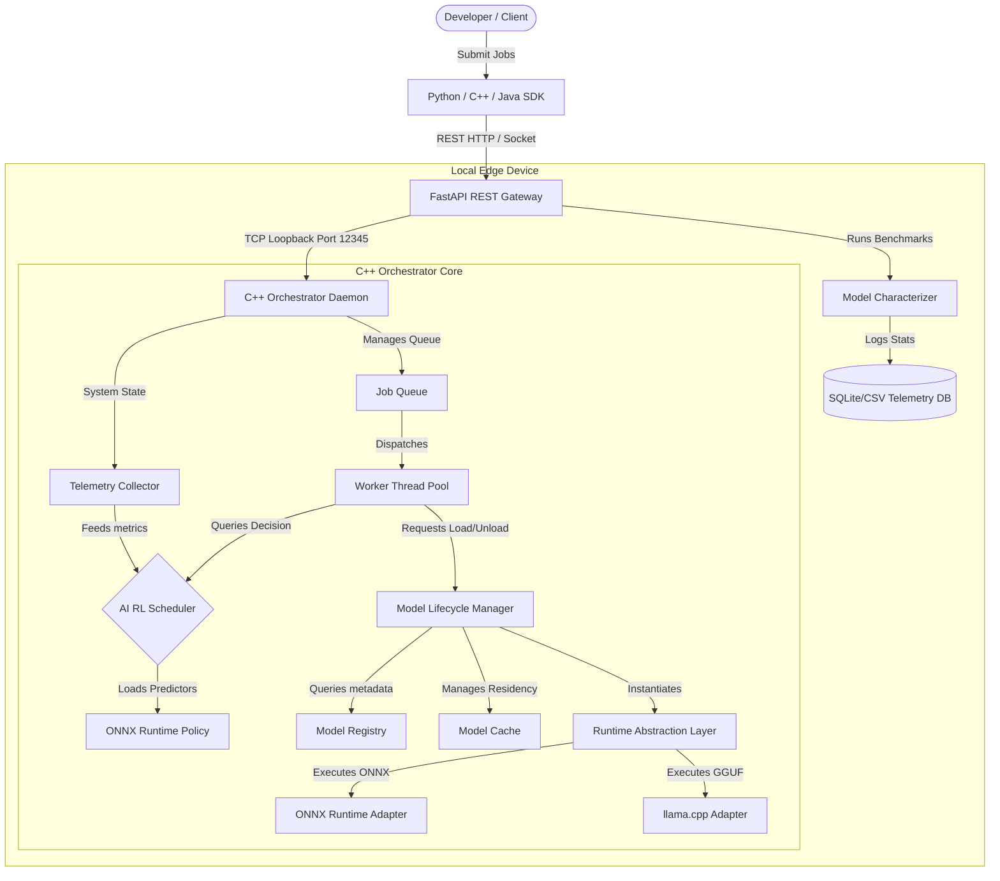

# ▲ EdgePilot — Adaptive AI Workload Orchestrator

> **Run AI smarter, not harder.** EdgePilot is an OS-inspired dynamic on-device orchestration framework that learns from every inference to optimize job scheduling, runtime selection, and model lifecycles—completely offline.

---

## 1. Project, Problem, and Solution

### The Problem
On-device AI models (such as large language models and deep vision classifiers) are highly resource-intensive. When deployed on resource-constrained edge devices, they face strict limitations:
* **Memory Constraints:** Loading multiple heavy models (like LLaMA-3) simultaneously triggers Out-of-Memory (OOM) faults.
* **Thermal Throttling:** Continuous execution causes rapid CPU/GPU temperature spikes, triggering hardware throttling and degrading performance.
* **Battery Drain:** High peak execution power quickly depletes mobile/embedded battery life.
* **Static Orchestration Failure:** Traditional systems use hardcoded scheduling policies that cannot adapt to dynamic changes in hardware state (e.g., thermal levels or battery percentage).

### The Solution: EdgePilot
**EdgePilot** introduces an intelligent, OS-inspired orchestration engine that acts as an intermediate layer between execution gateways and backend neural runtimes. Key highlights:
1. **Adaptive Scheduling:** Uses local telemetry predictors and a C++ Reinforcement Learning (PPO Policy) scheduler to route jobs dynamically.
2. **Dynamic Quantization Scaling:** Downscales precision (e.g., FP32 $\rightarrow$ INT8/INT4) in real-time when the battery drops below critical thresholds.
3. **Smart Model Residency Cache:** Blocks unload operations during active inference using thread-safe reference counts, evicting inactive models only when RAM pressure increases.
4. **Thermal-Aware Execution:** Automatically introduces execution delays to allow processors to recover from thermal spikes.

---

## 2. On-Device AI: Model, Runtime, and Device

EdgePilot runs **100% locally**, requiring zero internet connectivity or cloud API dependencies, ensuring absolute data privacy.

| Model / Network | Format | Target Task | Primary Runtime |
| :--- | :--- | :--- | :--- |
| **LLaMA-3 8B** | `.gguf` | Local Text Generation & NLP | `llama.cpp` |
| **ResNet-50** | `.onnx` | Deep CNN Image Classification | ONNX Runtime (CPU/GPU) |
| **latency_predictor** | `.onnx` | Telemetry performance estimation | ONNX Runtime (CPU) |
| **memory_predictor** | `.onnx` | RAM usage estimation | ONNX Runtime (CPU) |
| **energy_predictor** | `.onnx` | Execution energy usage estimation | ONNX Runtime (CPU) |
| **thermal_predictor** | `.onnx` | Temperature estimation | ONNX Runtime (CPU) |
| **rl_scheduler_policy** | `.onnx` | Custom PPO RL action recommendation | ONNX Runtime (CPU) |

### Runtime Abstraction Layer (RAL)
* **ONNX Runtime (C++ API):** Used for lightweight vision classification models, runtime characterization baselines, and the telemetry scheduling policy network.
* **llama.cpp (C++ API):** Used for transformer architectures to enable high-efficiency local weight streaming, CPU/GPU hybrid offloading, and custom quantization variants (`q4_k_m`, `fp16`).

### Device Compatibility
* **Host Platform:** Local edge hardware (currently configured for Windows via MinGW/MSVC; cross-platform compatible).
* **Compute Targets:** CPU execution with support for local GPU/NPU acceleration.

---

## 3. Tech Stack, Setup, and Usage

### Tech Stack
* **Core Core Daemon:** C++17, CMake, TCP IPC loopback sockets (`ws2_32` on Windows).
* **API REST Gateway:** Python 3, FastAPI, Uvicorn, SQLite (telemetry log db), Pandas, NumPy, PyTorch (policy training).
* **Web UI Dashboard:** Vanilla HTML5, CSS3, JavaScript. Styled with modern glowing elements and live metrics visualization.
* **Developer SDKs:** Native bindings for **C++** (direct socket connections), **Python** (REST wrapper), and **Java** (HTTP Client).

### System Architecture


---

## 4. Steps to Reproduce (Easy & Concise)

Follow these steps to build and run the entire EdgePilot suite locally.

### Step 1: Build the C++ Daemon
Ensure you have a C++17 compiler (GCC or MSVC) and CMake installed:
```powershell
# Generate CMake build cache
cmake -S . -B build -DCMAKE_BUILD_TYPE=Release -DEDGEPILOT_BUILD_TESTS=ON

# Compile the daemon and unit tests
cmake --build build
```

### Step 2: Set Up Python Environment
Install the API gateway dependencies:
```powershell
# Create and activate a python virtual environment
python -m venv .venv
.venv\Scripts\activate

# Install required packages
pip install fastapi uvicorn requests pandas numpy torch
```

### Step 3: Run the Orchestrator Launcher
Launch the daemon, the REST gateway, and open the web dashboard:
```powershell
.\run_edgepilot.bat
```
*(This opens two terminal windows: one running the C++ background daemon on port `12345` and one running the FastAPI gateway on port `8000`).*

---

## 5. Demo and Sandbox Execution

### Accessing the Dashboard
Once launched, open your browser and navigate to:
👉 **[http://localhost:8000/dashboard/](http://localhost:8000/dashboard/)**

### Interactive Scenarios in the Sandbox
1. **Sequential Pipeline Run:** Pipes the image classification tag output from `resnet50` directly as the text prompt to `llama3-8b` in sequence.
2. **Concurrent Batch Load Test:** Submits 10 mixed jobs concurrently with varying priority levels to verify C++ worker pool scheduling, telemetry prediction, and online RL retraining triggers.
3. **Model Profiler & Registration:** Allows you to upload a local `.onnx` or `.gguf` file, profiles it dynamically using synthetic benchmarks to solve the cold-start problem, and registers it to the orchestrator.

> [!NOTE]
> When jobs complete, the Python gateway automatically initiates a background execution log sync, triggering continuous online policy updates (`relearn_online`) in PyTorch.

---

## 6. License, Limitations, and Future Scope

### License
This project is licensed under the **MIT License** - see the LICENSE file for details.

### Current Limitations
* **Simulated Execution Adapters:** The ONNX and llama.cpp adapter layers in the core library execute deterministic profiling stubs. Real downstream hardware pipeline integration requires linking target DLLs/SO files.
* **Platform Dependence:** Launch wrappers and file-browsers are optimized for Windows shell operations (`cmd` and `tkinter`).

### Future Scope
* **Hardware-Accelerated Execution:** Link target runtime backends to execute on physical NPUs, Apple Silicon CoreML, and Nvidia TensorRT.
* **Multi-Agent Edge Swarms:** Enable workload offloading and distributed cooperative scheduling across local mesh networks.
* **Fine-grained Power Management:** Integrate hardware level frequency scaling (DVFS) controllers directly into the C++ orchestrator loop.
